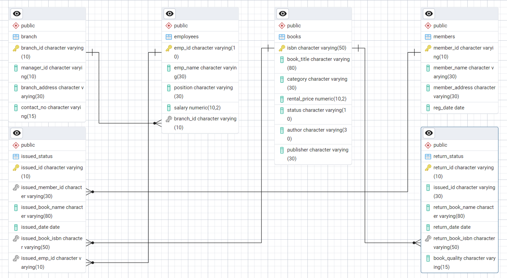

# Library Management System using PostgreSQL

## Project Overview

**Project Title**: Library Management System
**Level**: Intermediate
**Database**: `library_management`

This project aims to develop a fully functional Library Management System using PostgreSQL. The system manages the library's operations including book management, member registration, book issuance, and returns. It provides hands-on experience in database design, data manipulation, and complex SQL queries.

### Key Skills Learned:
- Database table design and management.
- Performing CRUD operations (Create, Read, Update, Delete).
- Using SQL joins for data extraction.
- Implementing advanced SQL concepts like CTAS, subqueries, and stored procedures.
- Generating insightful reports for library management.

---

## Objective

The primary goals of this SQL project are:

- **Design a relational database schema** for the library system.
- **Demonstrate proficiency in SQL operations** including DDL (Data Definition Language) and DML (Data Manipulation Language).
- **Apply advanced SQL concepts** such as CTAS (Create Table As Select) and subqueries.
- **Analyze and report library operations**, including member activity, book issuance, and branch performance.

---

## Database Schema Setup

The Library Management System's schema consists of multiple tables that represent various entities in the library. Below is the structure of the tables:

### ER Diagram



### Table Creation Scripts

```sql
-- Create table "Branch"
DROP TABLE IF EXISTS branch;
CREATE TABLE branch (
    branch_id VARCHAR(10) PRIMARY KEY,
    manager_id VARCHAR(10),
    branch_address VARCHAR(30),
    contact_no VARCHAR(15)
);

-- Create table "Employee"
DROP TABLE IF EXISTS employees;
CREATE TABLE employees (
    emp_id VARCHAR(10) PRIMARY KEY,
    emp_name VARCHAR(30),
    position VARCHAR(30),
    salary DECIMAL(10,2),
    branch_id VARCHAR(10),
    FOREIGN KEY (branch_id) REFERENCES branch(branch_id)
);

-- Create table "Members"
DROP TABLE IF EXISTS members;
CREATE TABLE members (
    member_id VARCHAR(10) PRIMARY KEY,
    member_name VARCHAR(30),
    member_address VARCHAR(30),
    reg_date DATE
);

-- Create table "Books"
DROP TABLE IF EXISTS books;
CREATE TABLE books (
    isbn VARCHAR(50) PRIMARY KEY,
    book_title VARCHAR(80),
    category VARCHAR(30),
    rental_price DECIMAL(10,2),
    status VARCHAR(10),
    author VARCHAR(30),
    publisher VARCHAR(30)
);

-- Create table "IssuedStatus"
DROP TABLE IF EXISTS issued_status;
CREATE TABLE issued_status (
    issued_id VARCHAR(10) PRIMARY KEY,
    issued_member_id VARCHAR(30),
    issued_book_name VARCHAR(80),
    issued_date DATE,
    issued_book_isbn VARCHAR(50),
    issued_emp_id VARCHAR(10),
    FOREIGN KEY (issued_member_id) REFERENCES members(member_id),
    FOREIGN KEY (issued_emp_id) REFERENCES employees(emp_id),
    FOREIGN KEY (issued_book_isbn) REFERENCES books(isbn)
);

-- Create table "ReturnStatus"
DROP TABLE IF EXISTS return_status;
CREATE TABLE return_status (
    return_id VARCHAR(10) PRIMARY KEY,
    issued_id VARCHAR(30),
    return_book_name VARCHAR(80),
    return_date DATE,
    return_book_isbn VARCHAR(50),
    FOREIGN KEY (return_book_isbn) REFERENCES books(isbn)
);
```

---

## Data Exploration and Validation

You can run the following queries to explore and validate the data within the tables:

```sql
SELECT * FROM books;
SELECT * FROM branch;
SELECT * FROM employees;
SELECT * FROM issued_status;
SELECT * FROM return_status;
SELECT * FROM members;
```

---

## CRUD Operations

These are some examples of basic CRUD (Create, Read, Update, Delete) operations within the system:

### Create a New Book Record:
```sql
INSERT INTO books(isbn, book_title, category, rental_price, status, author, publisher)
VALUES ('978-1-60129-456-2', 'To Kill a Mockingbird', 'Classic', 6.00, 'yes', 'Harper Lee', 'J.B. Lippincott & Co.');
SELECT * FROM books;
```

### Update a Member's Address:
```sql
UPDATE members
SET member_address = '125 Main St'
WHERE member_id = 'C101';
SELECT * FROM members;
```

### Delete an Issued Book Record:
```sql
DELETE FROM issued_status
WHERE issued_id = 'IS121';
SELECT * FROM issued_status;
```

---

## CTAS (Create Table As Select) Operations

You can also generate summary tables based on specific queries, such as:

### Create a Summary Table of Issued Books:
```sql
CREATE TABLE book_summary
AS
SELECT b.isbn, b.book_title, COUNT(isu.issued_id) AS no_issued
FROM books AS b
JOIN issued_status AS isu ON isu.issued_book_isbn = b.isbn
GROUP BY 1, 2;
SELECT * FROM book_summary;
```

---

## Data Analysis Queries

### Retrieve Books in a Specific Category:
```sql
SELECT * FROM books
WHERE category = 'History';
```

### Total Rental Income by Category of Issued Books:
```sql
SELECT b.category, SUM(b.rental_price), COUNT(*)
FROM books AS b
JOIN issued_status AS isu ON isu.issued_book_isbn = b.isbn
GROUP BY 1;
```

---

## Advanced SQL Operations

### Identify Members with Overdue Books:
```sql
SELECT isu.issued_member_id, m.member_name, bk.book_title, isu.issued_date,
    CURRENT_DATE - isu.issued_date AS overdue_days
FROM issued_status AS isu
JOIN members AS m ON m.member_id = isu.issued_member_id
JOIN books AS bk ON bk.isbn = isu.issued_book_isbn
LEFT JOIN return_status AS rs ON rs.issued_id = isu.issued_id
WHERE rs.return_date IS NULL
AND (CURRENT_DATE - isu.issued_date) > 30
ORDER BY 1;
```

### Branch Performance Report:
```sql
CREATE TABLE branch_reports AS
SELECT b.branch_id, b.manager_id, COUNT(isu.issued_id) AS number_book_issued,
    COUNT(rs.return_id) AS number_of_book_return, SUM(bk.rental_price) AS total_revenue
FROM issued_status AS isu
JOIN employees AS e ON e.emp_id = isu.issued_emp_id
JOIN branch AS b ON e.branch_id = b.branch_id
LEFT JOIN return_status AS rs ON rs.issued_id = isu.issued_id
JOIN books AS bk ON isu.issued_book_isbn = bk.isbn
GROUP BY 1, 2;
SELECT * FROM branch_reports;
```

---

## Reports

### 1. **Database Schema**
The schema consists of the following tables:
- **Branch**: Contains branch information.
- **Employees**: Stores employee details.
- **Members**: Holds member details.
- **Books**: Contains book information.
- **IssuedStatus**: Tracks issued books.
- **ReturnStatus**: Stores return details.

### 2. **Data Analysis & Findings**
- **Book Categories**: Retrieve books from specific categories like 'History'.
- **Employee Salaries**: Retrieve employee details, including salary and branch information.
- **Member Registration Trends**: List members who registered in the last 180 days.

### 3. **Summary Reports**
- **Branch Performance**: Summary of issued, returned books, and total revenue by branch.
- **Book Summary**: Summary of books issued based on categories.

---

## Learning Outcomes

- **DDL and DML Operations**: Creating tables, establishing relationships, and manipulating data.
- **Advanced SQL Queries**: Using joins, groupings, and subqueries for complex data analysis.
- **Data Reporting**: Creating insightful reports for library management, such as overdue books and branch performance.

---

## Developed By

**Abhimanyu Kumar**
**Date**: 19-01-2025
[LinkedIn Profile](https://www.linkedin.com/in/abhimanyu7870/)

---

Thank you for reviewing the Library Management System project!